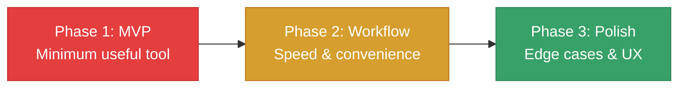
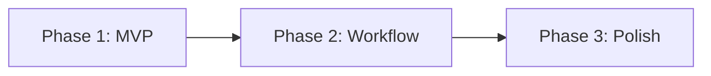

# Tool Roadmap Planner Skill

This skill creates phased implementation roadmaps for development tools. Takes a tool spec and breaks it into concrete, actionable phases with clear deliverables. No time estimates - just logical sequencing.

## When to Use This Skill

Invoke this skill when the user:
- Has a tool spec and wants to plan implementation
- Says "create roadmap for [tool]" or "plan [tool] development"
- Asks "how should I build this tool?"
- Wants to break a tool into MVP and future phases
- Says "roadmap" after creating a tool spec

---

## Roadmap Philosophy

### Phase Structure



### Phase Goals

| Phase | Goal | Exit Criteria |
|-------|------|---------------|
| **MVP** | Tool is usable for its core purpose | Primary workflow works end-to-end |
| **Workflow** | Tool is efficient to use daily | No friction in common operations |
| **Polish** | Tool handles edge cases gracefully | Ready for other team members |

---

## Roadmap Generation Process

### Step 1: Read Tool Spec

If spec exists at `docs/tools/[tool-name]-spec.md`:
- Extract MVP features
- Extract nice-to-have features
- Note success criteria
- Identify technical constraints

If no spec exists:
- Prompt user to run `tool-spec-generator` first
- Or gather minimal requirements inline

### Step 2: Define Phases

Break features into phases following the MVP → Workflow → Polish pattern.

### Step 3: Create Deliverables

For each phase, list concrete deliverables that can be checked off.

---

## Roadmap Template

```markdown
# Tool Roadmap: [Tool Name]

**Spec:** `docs/tools/[tool-name]-spec.md`
**Created:** [Date]

---

## Overview



**Goal:** [One sentence - what this tool enables]

---

## Phase 1: MVP (Minimum Viable Tool)

**Goal:** [Core functionality works end-to-end]

**Exit Criteria:** [When to move to Phase 2]

### Deliverables

- [ ] **[Deliverable 1]**
  - [Sub-task if needed]
  - [Sub-task if needed]

- [ ] **[Deliverable 2]**
  - [Sub-task if needed]

- [ ] **[Deliverable 3]**

### Technical Setup
- [ ] Create project/plugin structure
- [ ] Set up any dependencies
- [ ] Basic file I/O working

### Test Criteria
- [ ] [Specific test case]
- [ ] [Specific test case]

---

## Phase 2: Workflow Improvements

**Goal:** [Make daily use efficient]

**Prerequisites:** Phase 1 complete

### Deliverables

- [ ] **[Deliverable 1]**
  - [Sub-task]

- [ ] **[Deliverable 2]**

- [ ] **[Deliverable 3]**

### UX Improvements
- [ ] [Shortcut/convenience feature]
- [ ] [Feedback/status indicators]

### Test Criteria
- [ ] [Workflow test case]

---

## Phase 3: Polish & Edge Cases

**Goal:** [Production-ready, handles edge cases]

**Prerequisites:** Phase 2 complete, used in real workflows

### Deliverables

- [ ] **[Deliverable 1]**

- [ ] **[Deliverable 2]**

### Error Handling
- [ ] [Edge case 1]
- [ ] [Edge case 2]

### Documentation
- [ ] Usage instructions
- [ ] Known limitations

---

## Future Ideas (Backlog)

Ideas that might be valuable but aren't committed:

- [Idea 1]
- [Idea 2]
- [Idea 3]

---

## Dependencies

| Dependency | Required By | Notes |
|------------|-------------|-------|
| [Dependency] | Phase X | [Notes] |

---

## Risk Mitigation

| Risk | Impact | Mitigation |
|------|--------|------------|
| [Risk] | [Impact] | [How to handle] |
```

---

## Phase Breakdown Guidelines

### Phase 1: MVP - What Goes Here

**Include:**
- Core functionality that makes the tool useful
- Minimum UI to operate the tool
- Basic file I/O
- Happy path only (no error handling)

**Exclude:**
- Shortcuts and conveniences
- Polish and animations
- Error handling for edge cases
- Configuration options

**Rule of thumb:** If you could use the tool with this phase only (even if clunky), it's MVP.

### Phase 2: Workflow - What Goes Here

**Include:**
- Keyboard shortcuts
- Drag-and-drop
- Auto-refresh/live updates
- Sorting, filtering, search
- Recent files / history
- Undo/redo
- Status indicators

**Exclude:**
- Edge case handling
- Documentation
- Settings/preferences
- Multi-user support

**Rule of thumb:** Features that save clicks and time.

### Phase 3: Polish - What Goes Here

**Include:**
- Error handling and recovery
- Edge cases (empty data, corrupted files)
- Loading states and feedback
- Settings and preferences
- Documentation
- Performance optimization

**Rule of thumb:** Things you'd be embarrassed to ship without.

---

## Examples by Tool Type

### Editor Plugin Roadmap Example

```markdown
# Tool Roadmap: Balance Dashboard Dock

## Phase 1: MVP

**Goal:** View weapon and enemy stats in a dock

### Deliverables
- [ ] **Plugin setup**
  - Create addon folder structure
  - Register EditorPlugin
  - Create dock scene

- [ ] **Data loading**
  - Scan for WeaponData resources
  - Scan for EnemyData resources
  - Load into memory

- [ ] **Weapon table**
  - Display weapon name, damage, fire_rate
  - Calculate DPS column

- [ ] **Enemy table**
  - Display enemy name, HP, damage, speed

### Test Criteria
- [ ] Dock appears in editor
- [ ] Shows all weapon/enemy resources
- [ ] DPS calculation is correct

---

## Phase 2: Workflow Improvements

**Goal:** Efficient daily balance work

### Deliverables
- [ ] **Sort by column** - Click header to sort
- [ ] **Filter by type** - Dropdown to filter
- [ ] **Open resource** - Double-click row opens .tres
- [ ] **Auto-refresh** - Detect resource changes
- [ ] **Search** - Filter by name

---

## Phase 3: Polish

### Deliverables
- [ ] **TTK calculation** - Time-to-kill column
- [ ] **Export to CSV** - For spreadsheet analysis
- [ ] **Highlight outliers** - Color cells that are extreme
- [ ] **Empty state** - Message when no resources found
```

### CLI Tool Roadmap Example

```markdown
# Tool Roadmap: Dialogue Validator

## Phase 1: MVP

**Goal:** Validate dialogue JSON files

### Deliverables
- [ ] **Argument parsing** - Accept file/folder path
- [ ] **JSON parsing** - Load and validate syntax
- [ ] **Node reference check** - Verify all node_id references exist
- [ ] **Output report** - Print issues to stdout
- [ ] **Exit codes** - 0 for pass, 1 for fail

### Test Criteria
- [ ] Catches invalid JSON
- [ ] Catches missing node references
- [ ] Returns exit code 1 on failure

---

## Phase 2: Workflow Improvements

**Goal:** Useful in development workflow

### Deliverables
- [ ] **Orphan detection** - Find unreachable nodes
- [ ] **Watch mode** - Re-validate on file change
- [ ] **JSON output** - Machine-readable results
- [ ] **Config file** - .dialoguelintrc for options

---

## Phase 3: Polish

### Deliverables
- [ ] **Condition validation** - Check condition syntax
- [ ] **Variable tracking** - Warn on undefined variables
- [ ] **Auto-fix** - Fix simple issues automatically
- [ ] **Integration docs** - CI/CD setup guide
```

---

## Output Location

Save roadmaps to: `docs/tools/[tool-name]-roadmap.md`

**Examples:**
- `docs/tools/balance-dashboard-roadmap.md`
- `docs/tools/dialogue-validator-roadmap.md`

---

## Workflow Summary

1. User says "create roadmap for [tool]" or runs after tool-spec-generator
2. Read tool spec if exists
3. Ask clarifying questions if needed
4. Generate roadmap with 3 phases
5. Display in chat
6. Save to `docs/tools/[name]-roadmap.md`

---

## Integration with Other Skills

### With `tool-spec-generator`
- Spec defines WHAT (features, success criteria)
- Roadmap defines HOW (phased delivery)
- Natural flow: spec → roadmap → implementation

### With `changelog-updater`
- As phases complete, update changelog
- Track tool versions separately from game

### With `architecture-documenter`
- Document tool architecture if complex
- Add to project architecture if it integrates deeply

---

This skill ensures tools are built incrementally with clear milestones, avoiding scope creep and ensuring value at each phase.
