# BLOOD & GOLD - Architecture Document

**Version:** 0.1.0
**Engine:** Godot 4.5
**Last Updated:** 2026-01-11
**Phase:** 1 - Combat Foundation (In Progress)

---

## TABLE OF CONTENTS

1. [High-Level Architecture](#high-level-architecture)
2. [Main Scene Tree](#main-scene-tree)
3. [System Scene Trees](#system-scene-trees)
4. [Data Architecture](#data-architecture)
5. [Resource Definitions](#resource-definitions)
6. [Signal Map](#signal-map)
7. [Group Registry](#group-registry)
8. [Autoload Registry](#autoload-registry)
9. [Collision Layers](#collision-layers)
10. [File Structure](#file-structure)

---

## HIGH-LEVEL ARCHITECTURE

### Game Structure Overview


### Core Game Loop


### Layer Architecture


---

## MAIN SCENE TREE

### Main.tscn (Entry Point)


### Scene Hierarchy

```mermaid
graph TB
    subgraph scenes["res://scenes/"]
        main["main/<br/>Main.tscn ✓"]
        combat["combat/<br/>CombatGrid.tscn ✓"]
        player["player/<br/>(planned)"]
        enemies["enemies/<br/>(planned)"]
        weapons["weapons/<br/>(planned)"]
        effects["effects/<br/>(planned)"]
        levels["levels/<br/>(planned)"]
        UI["UI/<br/>(planned)"]
    end

    main -.->|"entry point"| combat

    style main fill:#48bb78,stroke:#38a169,color:#fff
    style combat fill:#48bb78,stroke:#38a169,color:#fff
    style player fill:#a0aec0,stroke:#718096,color:#fff
    style enemies fill:#a0aec0,stroke:#718096,color:#fff
    style weapons fill:#a0aec0,stroke:#718096,color:#fff
    style effects fill:#a0aec0,stroke:#718096,color:#fff
    style levels fill:#a0aec0,stroke:#718096,color:#fff
    style UI fill:#a0aec0,stroke:#718096,color:#fff
```



---

## SYSTEM SCENE TREES

### CombatGrid.tscn (Implemented)


**CombatGrid Properties:**

| Property | Type | Value | Purpose |
|----------|------|-------|---------|
| GRID_WIDTH | const int | 12 | Grid columns |
| GRID_HEIGHT | const int | 12 | Grid rows |
| TILE_SIZE | const int | 64 | Pixels per tile |
| TILE_WALKABLE | const int | 0 | Walkable tile type |
| TILE_OBSTACLE | const int | 1 | Obstacle tile type |

**CombatGrid Colors:**

| Color | Hex | Purpose |
|-------|-----|---------|
| COLOR_WALKABLE | #4a6741 | Walkable tile fill |
| COLOR_WALKABLE_BORDER | #3d5636 | Walkable tile border |
| COLOR_OBSTACLE | #2d3436 | Obstacle tile fill |
| COLOR_OBSTACLE_BORDER | #1a1a2e | Obstacle tile border |
| COLOR_BACKGROUND | #0d1117 | Grid background |

**CombatGrid Public API:**

```gdscript
# Tile queries
get_tile_type(coords: Vector2i) -> int
is_walkable(coords: Vector2i) -> bool
is_obstacle(coords: Vector2i) -> bool

# Coordinate conversion
world_to_grid(world_pos: Vector2) -> Vector2i
grid_to_world(grid_coords: Vector2i) -> Vector2

# Grid info
get_grid_size() -> Vector2i
get_tile_size() -> int
get_grid_pixel_size() -> Vector2

# Tile modification
set_tile_walkable(coords: Vector2i) -> void
set_tile_obstacle(coords: Vector2i) -> void
clear_grid() -> void
```

---

### Planned Scene Trees

#### Unit Inheritance Hierarchy


#### Unit.tscn (Planned)


#### PartyMember.tscn (Planned)


#### Soldier.tscn (Planned)


#### Enemy.tscn (Planned)


---

## DATA ARCHITECTURE

### Game Data Overview


### Data Types Registry

| Data Type | Format | Location | Purpose | Status |
|-----------|--------|----------|---------|--------|
| CharacterData | .tres | `resources/data/characters/` | Party member stats, abilities | Planned |
| WeaponData | .tres | `resources/data/weapons/` | Weapon stats, damage types | Planned |
| ArmorData | .tres | `resources/data/armor/` | Armor stats, movement penalty | Planned |
| AbilityData | .tres | `resources/data/abilities/` | Ability effects, costs | Planned |
| EnemyData | .tres | `resources/data/enemies/` | Enemy stats, behavior | Planned |
| SoldierData | .tres | `resources/data/soldiers/` | Soldier types, stats | Planned |
| ContractData | .json | `resources/data/contracts/` | Contract objectives, rewards | Planned |
| DialogueData | .json | `resources/data/dialogue/` | Dialogue trees, choices | Planned |

---

## RESOURCE DEFINITIONS

### CharacterData.tres Schema (Planned)

```gdscript
class_name CharacterData
extends Resource

# Identity
@export var id: String                    # "player", "thorne", "lyra", "matthias"
@export var display_name: String          # "Thorne Blackwood"
@export var portrait: Texture2D

# Base Stats (D&D-style)
@export var strength: int                 # STR: Melee damage, carry weight
@export var dexterity: int                # DEX: Initiative, ranged, defense
@export var constitution: int             # CON: HP, resistances
@export var intelligence: int             # INT: Ability power
@export var wisdom: int                   # WIS: Detection, willpower
@export var charisma: int                 # CHA: Dialogue, leadership

# Derived Stats
@export var max_hp: int                   # CON-based
@export var movement_speed: int           # Tiles per turn (4-6)
@export var initiative_bonus: int         # DEX modifier

# Combat
@export var abilities: Array[AbilityData] # 4 abilities per character
@export var starting_weapon: WeaponData
@export var starting_armor: ArmorData

# Companion-specific
@export var loyalty_triggers_positive: Array[String]  # ["honor", "protecting_team"]
@export var loyalty_triggers_negative: Array[String]  # ["betrayal", "cruelty"]
```

### WeaponData.tres Schema (Planned)

```gdscript
class_name WeaponData
extends Resource

@export var id: String                    # "iron_sword"
@export var display_name: String          # "Iron Sword"
@export var description: String

# Combat Stats
@export var damage_dice: String           # "1d8"
@export var damage_bonus: int             # +0 to +3
@export var damage_type: DamageType       # SLASHING, PIERCING, BLUDGEONING
@export var range: int                    # 1 for melee, 8-10 for ranged
@export var is_ranged: bool               # true for bows/crossbows

# Special Properties
@export var crit_range: int               # 20 (normal) or 19-20 (improved)
@export var armor_bonus: int              # +2 vs armored for maces
@export var reach: bool                   # Spears can attack 2 tiles away
@export var reload: bool                  # Crossbows skip turn after shot

# Economy
@export var cost: int                     # Gold cost
@export var icon: Texture2D
```

### AbilityData.tres Schema (Planned)

```gdscript
class_name AbilityData
extends Resource

@export var id: String                    # "power_attack"
@export var display_name: String          # "Power Attack"
@export var description: String           # "Deal +50% damage but -2 to hit"

# Targeting
@export var target_type: TargetType       # SELF, ALLY, ENEMY, TILE, AOE
@export var range: int                    # Tiles
@export var aoe_radius: int               # For AOE abilities

# Effects
@export var damage_multiplier: float      # 1.5 for Power Attack
@export var hit_modifier: int             # -2 for Power Attack
@export var status_effect: StatusEffect   # STUN, BLEED, SLOW, etc.
@export var status_duration: int          # Turns

# Cooldown
@export var cooldown_turns: int           # 0 = no cooldown
@export var uses_per_battle: int          # -1 = unlimited

# Visuals
@export var icon: Texture2D
@export var animation: String             # Animation name to play
```

### SoldierOrder Enum (Planned)

```gdscript
enum SoldierOrder {
    ADVANCE,      # Move toward nearest enemy, engage in melee
    HOLD_LINE,    # Stay in position, attack enemies in range
    FOCUS_FIRE,   # All soldiers target designated enemy
    RETREAT,      # Fall back toward map edge
    PROTECT       # Guard a specific party member
}
```

---

## SIGNAL MAP

### Signal Flow Overview


### CombatGrid Signals (Implemented)


### Planned Global Signals (via Autoloads)


### Planned Entity Signals


---

## GROUP REGISTRY

### Group Hierarchy


### Planned Groups

| Group Name | Used By | Purpose |
|------------|---------|---------|
| `units` | All units (party, soldiers, enemies) | Global unit queries |
| `party` | Player character + companions | Party-specific logic |
| `soldiers` | NPC soldiers under player command | Soldier order system |
| `enemies` | All enemy units | Enemy targeting |
| `player_controlled` | Party + soldiers | Player's forces |
| `selectable` | Units that can be selected | Selection system |
| `targetable` | Valid attack targets | Targeting system |
| `obstacles` | Grid obstacles, destructibles | Pathfinding |

### Group Usage Patterns (Planned)

```gdscript
# Get all player forces
var player_units = get_tree().get_nodes_in_group("player_controlled")

# Get all enemies for targeting
var enemies = get_tree().get_nodes_in_group("enemies")

# Issue order to all soldiers
for soldier in get_tree().get_nodes_in_group("soldiers"):
    soldier.receive_order(SoldierOrder.ADVANCE)

# Check if combat is over
var enemies_left = get_tree().get_nodes_in_group("enemies").size()
var allies_left = get_tree().get_nodes_in_group("player_controlled").size()
```

---

## AUTOLOAD REGISTRY

### Autoload Dependency Graph


### Planned Autoloads

| Name | Path | Purpose | Status |
|------|------|---------|--------|
| GameManager | `scripts/autoload/game_manager.gd` | Global state, scene transitions | Planned |
| TurnManager | `scripts/autoload/turn_manager.gd` | Turn order, initiative | Planned |
| CombatManager | `scripts/autoload/combat_manager.gd` | Combat logic, damage calculation | Planned |
| LoyaltyManager | `scripts/autoload/loyalty_manager.gd` | Companion loyalty tracking | Planned |
| DialogueManager | `scripts/autoload/dialogue_manager.gd` | Dialogue tree processing | Planned |
| SaveManager | `scripts/autoload/save_manager.gd` | Save/load (post-prototype) | Planned |

---

## COLLISION LAYERS

### Collision Layer Diagram


### Planned Layer Definitions

| Layer | Bit | Name | Purpose |
|-------|-----|------|---------|
| 1 | 1 | grid_tiles | Grid walkable/obstacle detection |
| 2 | 2 | player_units | Party members and soldiers |
| 3 | 4 | enemy_units | Enemy units |
| 4 | 8 | projectiles | Arrows, magic projectiles |
| 5 | 16 | interactables | Chests, levers, etc. |
| 6 | 32 | triggers | Area triggers (ambush, cutscene) |

### Collision Matrix


---

## FILE STRUCTURE

### Directory Tree

```mermaid
graph TB
    Root["blood-&-gold/"]

    subgraph Core["Core Directories"]
        Scenes["scenes/"]
        Scripts["scripts/"]
        Resources["resources/"]
        Assets["assets/"]
    end

    subgraph Support["Support Directories"]
        Docs["docs/"]
        Tests["tests/"]
        Tools["tools/"]
        Exports["exports/"]
    end

    subgraph Config["Config"]
        Claude[".claude/"]
        Addons["addons/"]
        ProjectGodot["project.godot"]
    end

    Root --> Core
    Root --> Support
    Root --> Config
```

### Scenes Directory

```mermaid
graph TB
    Scenes["scenes/"]
    Main["main/<br/>Main.tscn ✓"]
    Combat["combat/<br/>CombatGrid.tscn ✓"]
    Player["player/"]
    Enemies["enemies/"]
    Weapons["weapons/"]
    Effects["effects/"]
    Levels["levels/"]
    UI["UI/"]

    Scenes --> Main
    Scenes --> Combat
    Scenes --> Player
    Scenes --> Enemies
    Scenes --> Weapons
    Scenes --> Effects
    Scenes --> Levels
    Scenes --> UI

    style Main fill:#48bb78,stroke:#38a169,color:#fff
    style Combat fill:#48bb78,stroke:#38a169,color:#fff
```

### Scripts Directory

```mermaid
graph TB
    Scripts["scripts/"]
    Autoload["autoload/"]
    CombatScripts["combat/<br/>combat_grid.gd ✓"]
    EnemyScripts["enemies/"]
    PlayerScripts["player/"]
    ResourceScripts["resources/"]
    Systems["systems/"]
    Utils["utils/"]
    WeaponScripts["weapons/"]

    Scripts --> Autoload
    Scripts --> CombatScripts
    Scripts --> EnemyScripts
    Scripts --> PlayerScripts
    Scripts --> ResourceScripts
    Scripts --> Systems
    Scripts --> Utils
    Scripts --> WeaponScripts

    style CombatScripts fill:#48bb78,stroke:#38a169,color:#fff
```

### Full Directory Structure

```
blood-&-gold/
├── .claude/                    # Claude Code skills and settings
├── addons/                     # Godot plugins
├── assets/
│   ├── animations/
│   ├── audio/
│   ├── fonts/
│   ├── shaders/
│   ├── sprites/tiles/
│   └── textures/
├── docs/
│   ├── features/
│   ├── implementation-reports/
│   ├── architecture.md         # This file
│   └── *.md
├── exports/{linux,mac,web,windows}/
├── resources/
│   ├── data/
│   ├── materials/
│   ├── themes/
│   └── tilesets/
├── scenes/
│   ├── combat/CombatGrid.tscn  ✓
│   ├── main/Main.tscn          ✓
│   └── {effects,enemies,levels,player,UI,weapons}/
├── scripts/
│   ├── combat/combat_grid.gd   ✓
│   └── {autoload,enemies,player,resources,systems,utils,weapons}/
├── tests/{integration,unit}/
├── tools/editor_scripts/
├── CLAUDE.md
└── project.godot
```

---

## IMPLEMENTATION STATUS

### Phase 1: Combat Foundation (Current)

```mermaid
gantt
    title Phase 1 Progress
    dateFormat X
    axisFormat %s

    section Completed
    Grid system (12x12)           :done, 0, 1
    Tile types                    :done, 0, 1
    Grid centering                :done, 0, 1
    Coordinate conversion         :done, 0, 1

    section Pending
    Unit placement                :active, 0, 1
    Unit selection                :0, 1
    Movement system               :0, 1
    Basic attack                  :0, 1
    Turn order                    :0, 1
    HP tracking                   :0, 1
    Victory/defeat                :0, 1
```

| Feature | Status | File(s) |
|---------|--------|---------|
| Grid system (12x12) | ✓ Complete | `combat_grid.gd`, `CombatGrid.tscn` |
| Tile types (walkable/obstacle) | ✓ Complete | `combat_grid.gd` |
| Grid centering | ✓ Complete | `combat_grid.gd` |
| Coordinate conversion | ✓ Complete | `combat_grid.gd` |
| Unit placement | Pending | - |
| Unit selection | Pending | - |
| Movement system | Pending | - |
| Basic attack | Pending | - |
| Turn order | Pending | - |
| HP tracking | Pending | - |
| Victory/defeat | Pending | - |

### Phase Overview

```mermaid
graph LR
    P1["Phase 1<br/>Combat Foundation<br/>🔄 In Progress"]
    P2["Phase 2<br/>Full Party Combat<br/>⏳ Pending"]
    P3["Phase 3<br/>Meta Loop<br/>⏳ Pending"]
    P4["Phase 4<br/>Polish & Playtest<br/>⏳ Pending"]

    P1 --> P2 --> P3 --> P4

    style P1 fill:#d69e2e,stroke:#b7791f,color:#fff
    style P2 fill:#a0aec0,stroke:#718096,color:#fff
    style P3 fill:#a0aec0,stroke:#718096,color:#fff
    style P4 fill:#a0aec0,stroke:#718096,color:#fff
```

---

## CHANGELOG

### 2026-01-11 - Initial Architecture Document
**Created:** Complete architecture documentation with Mermaid diagrams
**Documented:**
- Current implementation (Main.tscn, CombatGrid.tscn, combat_grid.gd)
- Planned scene structures
- Data architecture
- Signal map
- File structure

---

**END OF ARCHITECTURE DOCUMENT**

This document shows WHAT exists and HOW it's organized.
- For implementation details, see the Systems Bible (when created)
- For design rationale, see `docs/blood-and-gold-prototype-gdd.md`
- For feature specs, see `docs/features/`
