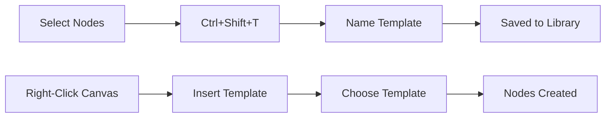
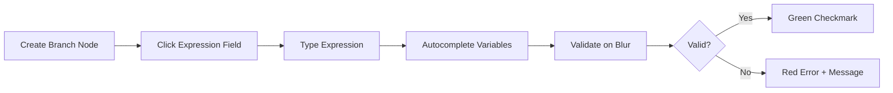
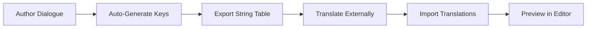
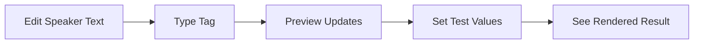

# Tool Spec: Dialogue Tree Editor - Phase 4 Enhancements

**Version:** 0.1
**Type:** Editor Plugin (Enhancement)
**Priority:** High
**Created:** 2026-01-13
**Base Tool:** `addons/dialogue_editor/`
**Prerequisites:** Phase 1-3 Complete (current state)

---

## Problem Statement

**Pain Point:**
The Dialogue Tree Editor is feature-complete for basic authoring, but lacks advanced features needed for production-scale games: writers recreate common patterns manually, conditions are limited to simple comparisons, and there's no localization support for multi-language releases.

**Current Workaround:**
- Writers copy-paste node clusters for common patterns (error-prone)
- Complex conditions require multiple Branch nodes in sequence
- Text is hardcoded - localization requires separate dialogue files per language
- Dynamic text (player name, item counts) requires external string substitution

**Impact:**
- Reduces writer productivity by 30-40% on repetitive patterns
- Limits game logic complexity achievable through dialogue
- Blocks release to non-English markets without major rework
- Prevents personalized player-facing text without code changes

---

## Target Users

| User | Use Case |
|------|----------|
| Dialogue Writer | Rapid creation using templates, dynamic text insertion |
| Narrative Designer | Complex branching with compound conditions |
| Localization Team | Export strings, import translations, preview languages |
| Programmer | Runtime variable access, expression evaluation |

---

## Core Functionality (MVP)

This spec covers 4 interconnected enhancements that together enable production-ready dialogue authoring.

### Enhancement 1: Node Templates & Snippets

**Must Have:**
1. **Built-in Template Library** - Pre-made templates for common patterns
2. **Save Selection as Template** - Create custom templates from selected nodes
3. **Insert Template** - Add templates via right-click menu or palette

**Nice to Have:**
- Template variable placeholders ({{SPEAKER}}, {{QUEST_ID}})
- Import/export templates for team sharing
- Template preview on hover

---

### Enhancement 2: Variables & Expression System

**Must Have:**
1. **Expression Syntax** - Compound conditions: `reputation >= 50 and has_item("key")`
2. **Variable Browser Panel** - List all variables used in dialogue tree
3. **Expression Editor** - Syntax highlighting and validation in Branch nodes
4. **Set Expression Node** - Assign multiple variables in one node

**Nice to Have:**
- Autocomplete for variable names
- Test expressions with sample values
- Built-in functions: `random()`, `count()`, `has_flag()`

---

### Enhancement 3: Localization Support

**Must Have:**
1. **Localization Keys** - Auto-generated keys for all text fields
2. **String Table Export** - Export all strings to CSV/PO format
3. **String Table Import** - Import translations back into editor
4. **Language Preview** - Switch preview language in editor

**Nice to Have:**
- Translation progress indicator
- Highlight untranslated strings
- Fallback language configuration

---

### Enhancement 4: Conditional Text Tags

**Must Have:**
1. **Variable Insertion** - `{player_name}`, `{gold_amount}` in text
2. **Inline Conditionals** - `{if noble}my lord{else}stranger{/if}`
3. **Tag Preview** - Render tags in property panel with sample values
4. **Formatting Tags** - `[b]bold[/b]`, `[color=red]text[/color]`

**Nice to Have:**
- Pluralization: `{plural:count|item|items}`
- Effect tags: `[shake]`, `[wave]`, `[pause=1.5]`
- Custom tag definitions

---

### Enhancement 5: Node Grouping & Organization

**Must Have:**
1. **Visual Groups** - Draw colored boxes around node clusters with labels
2. **Group Operations** - Select all in group, move group as unit
3. **Collapsible Groups** - Collapse group to single summary node
4. **Group Navigation** - Panel listing all groups with jump-to

**Nice to Have:**
- Auto-group by speaker or branch
- Swimlanes for character separation
- Subgraph nodes (reusable across dialogues)
- Folder organization with filtering

---

## User Workflows

### Template Workflow



**Primary Flow:**
1. Writer selects a group of connected nodes
2. Press Ctrl+Shift+T or right-click → "Save as Template"
3. Enter template name and optional description
4. Template appears in Template Library panel
5. Later: Right-click → Insert Template → Select template
6. Nodes created at cursor position, auto-connected if node selected

---

### Expression Workflow



**Primary Flow:**
1. Add or select a Branch node
2. Click on condition field (now an expression editor)
3. Type expression: `player_level >= 10 and quest_state("main") == "active"`
4. Autocomplete suggests variables as you type
5. On blur, expression is validated
6. Invalid expressions show error with specific issue
7. Variable Browser panel shows all referenced variables

---

### Localization Workflow



**Primary Flow:**
1. Writer creates dialogue in primary language (English)
2. Each text field automatically gets a localization key
3. Export → String Table exports CSV with all keys and text
4. Translators fill in other language columns
5. Import → String Table imports translations
6. Language dropdown in toolbar switches preview language
7. Exported JSON references keys (not raw text)

---

### Conditional Text Workflow



**Primary Flow:**
1. Writer edits Speaker node text field
2. Types: "Welcome back, {player_name}! You have {gold} gold."
3. Property panel shows rendered preview below text
4. Click "Test Values" to set sample data
5. Preview updates: "Welcome back, Sir Galahad! You have 150 gold."
6. Conditional: "{if has_key}The door is unlocked.{else}You need a key.{/if}"

---

## UI/UX Design

### Main Panel Changes

```
┌──────────────────────────────────────────────────────────────────┐
│  [New][Open][Save][Export] | [Test][Validate] | [Lang: EN ▾]    │
│  Search: [________] [Field▾] [<][>] 0/0 | [Filter▾]             │
├────────────────┬─────────────────────────────────────────────────┤
│ Node Palette   │                                                 │
│ ┌────────────┐ │  ┌─────────────────────────────────────────┐   │
│ │ Templates  │ │  │                                         │   │
│ │  ├ Greeting│ │  │           Canvas Area                   │   │
│ │  ├ Shop    │ │  │                                         │   │
│ │  ├ Quest   │ │  │                                         │   │
│ │  └ Custom..│ │  │                                         │   │
│ ├────────────┤ │  │                                         │   │
│ │ Core Nodes │ │  └─────────────────────────────────────────┘   │
│ │  ├ Start   │ │                                                 │
│ │  ├ Speaker │ ├─────────────────────────────────────────────────┤
│ │  ...       │ │ Variable Browser (Collapsible)                  │
│ ├────────────┤ │ ┌─────────────────────────────────────────────┐ │
│ │ Variables  │ │ │ player_level: 10  │ gold: 150  │ ...       │ │
│ │ [Browser]  │ │ └─────────────────────────────────────────────┘ │
│ └────────────┘ │                                                 │
├────────────────┴─────────────────────────────────────────────────┤
│  dialogue_id: tavern_greeting* | Nodes: 24 | Zoom: 100%          │
└──────────────────────────────────────────────────────────────────┘
```

### Key UI Elements

| Element | Purpose |
|---------|---------|
| Language Dropdown | Switch preview language (EN, ES, DE, etc.) |
| Templates Section | Collapsible palette section with template library |
| Variable Browser | Bottom panel showing all variables with test values |
| Expression Editor | Rich text field in Branch nodes with syntax highlighting |
| Text Preview | Below text fields, shows rendered tags |

### Template Library Panel

```
┌─────────────────────────────┐
│ Templates                [+]│
├─────────────────────────────┤
│ ▸ Built-in                  │
│   ├ Basic Greeting          │
│   ├ Shop Interaction        │
│   ├ Quest Offer             │
│   ├ Skill Check Gate        │
│   └ Information Loop        │
│ ▸ Custom                    │
│   ├ Tavern Rumors           │
│   └ Merchant Haggle         │
├─────────────────────────────┤
│ [Import] [Export]           │
└─────────────────────────────┘
```

### Expression Editor (in Branch Node)

```
┌─────────────────────────────────────────────────────────────┐
│ Branch Node                                                 │
├─────────────────────────────────────────────────────────────┤
│ Condition:                                                  │
│ ┌─────────────────────────────────────────────────────────┐ │
│ │ reputation.merchants >= 25 and has_item("guild_token") │ │
│ └─────────────────────────────────────────────────────────┘ │
│ ✓ Valid expression                                          │
│                                                             │
│                                          True →  ●          │
│                                          False → ●          │
└─────────────────────────────────────────────────────────────┘
```

### Localization Export Dialog

```
┌─────────────────────────────────────────────────────────────┐
│ Export String Table                                         │
├─────────────────────────────────────────────────────────────┤
│ Format:  ○ CSV  ● PO (gettext)  ○ JSON                     │
│                                                             │
│ Languages to include:                                       │
│ ☑ English (primary)                                        │
│ ☑ Spanish                                                  │
│ ☐ German                                                   │
│ ☐ French                                                   │
│                                                             │
│ Options:                                                    │
│ ☑ Include context comments                                 │
│ ☑ Include character limits                                 │
│ ☐ Export only untranslated                                 │
│                                                             │
│ Output: [res://localization/dialogue/________.csv  ] [...]  │
│                                                             │
│                                    [Cancel]  [Export]       │
└─────────────────────────────────────────────────────────────┘
```

---

## Technical Notes

### Integration Points

- **Existing Systems:** Extends current `dialogue_canvas.gd`, `dialogue_exporter.gd`
- **New Dependencies:** None (uses Godot built-ins)
- **Game Runtime:** Expression evaluator needed in `DialogueRunner`

### Data Format Changes

**.dtree format additions:**
```json
{
  "version": "2.0",
  "metadata": {
    "dialogue_id": "tavern_greeting",
    "primary_language": "en",
    "localization_enabled": true
  },
  "nodes": {
    "Speaker_1": {
      "type": "Speaker",
      "speaker": "Barkeep",
      "text": "Welcome, {player_name}!",
      "localization_key": "tavern_greeting.Speaker_1.text"
    }
  },
  "templates": {
    "embedded": []
  },
  "variables": {
    "referenced": ["player_name", "reputation.merchants"]
  }
}
```

**String table format (CSV):**
```csv
key,context,char_limit,en,es,de
tavern_greeting.Speaker_1.text,Barkeep greeting player,100,"Welcome, {player_name}!","¡Bienvenido, {player_name}!","Willkommen, {player_name}!"
tavern_greeting.Choice_2.text,Player response,50,"Show me your wares.","Muéstrame tu mercancía.","Zeig mir deine Waren."
```

**Expression syntax (EBNF):**
```
expression     = comparison ( ("and" | "or") comparison )*
comparison     = term ( ("==" | "!=" | ">" | "<" | ">=" | "<=") term )?
term           = factor ( ("+" | "-") factor )*
factor         = unary ( ("*" | "/") unary )*
unary          = ("not" | "-")? primary
primary        = NUMBER | STRING | BOOLEAN | variable | function_call | "(" expression ")"
variable       = IDENTIFIER ("." IDENTIFIER)*
function_call  = IDENTIFIER "(" (expression ("," expression)*)? ")"
```

### Constraints

- Expression parser must handle malformed input gracefully
- Localization keys must be stable across saves (don't regenerate)
- Template nodes need new IDs on insert (avoid collisions)
- Text tags must not break JSON export (proper escaping)

---

## Success Criteria

### MVP Complete When:

**Templates:**
- [ ] Can save 3+ connected nodes as template
- [ ] Can insert template from library
- [ ] Built-in templates available (Greeting, Shop, Quest, Skill Check)
- [ ] Templates persist across editor sessions

**Expressions:**
- [ ] Can type compound expression in Branch node
- [ ] Expression validates with clear error messages
- [ ] Variable Browser shows all referenced variables
- [ ] Expressions evaluate correctly in test mode

**Conditional Text:**
- [ ] Can use `{variable}` syntax in Speaker text
- [ ] Can use `{if}...{else}...{/if}` conditionals
- [ ] Preview panel shows rendered text
- [ ] Tags export correctly in JSON

**Node Grouping:**
- [ ] Can create visual group around selected nodes
- [ ] Can move group with all contained nodes
- [ ] Can collapse group to summary view
- [ ] Groups persist in .dtree save file

**Localization:**
- [ ] All text fields have auto-generated localization keys
- [ ] Can export string table to CSV
- [ ] Can import translations from CSV
- [ ] Can preview dialogue in different languages

### Tool is Successful When:
- Writers report 40%+ faster creation of common patterns
- Complex branching achievable without multiple Branch nodes
- Large dialogues (100+ nodes) remain navigable with grouping
- Game can ship in 3+ languages using localization export
- Dynamic text (names, counts) works without code changes

---

## Open Questions

- [ ] Should templates be per-project or global (shared across projects)?
- [ ] Expression syntax: Use GDScript-style or custom DSL?
- [ ] Localization: Support .po (gettext) in addition to CSV?
- [ ] How to handle localization key changes when nodes are deleted/recreated?
- [ ] Should Variable Browser show runtime values during game testing?

---

## File Structure

```
addons/dialogue_editor/
├── scripts/
│   ├── templates/
│   │   ├── template_manager.gd       # Template save/load/insert
│   │   ├── template_data.gd          # Template resource format
│   │   └── built_in_templates.gd     # Pre-made templates
│   ├── expressions/
│   │   ├── expression_lexer.gd       # Tokenizer
│   │   ├── expression_parser.gd      # Parser + AST
│   │   ├── expression_evaluator.gd   # Runtime evaluation
│   │   ├── expression_context.gd     # Test value management
│   │   └── expression_editor.gd      # UI component
│   ├── localization/
│   │   ├── localization_manager.gd   # Key generation, import/export
│   │   ├── string_table_exporter.gd  # CSV/PO export
│   │   ├── language_preview.gd       # Editor language switching
│   │   └── translation_tracker.gd    # Progress tracking
│   ├── text_tags/
│   │   ├── tag_parser.gd             # Parse {var} and {if} tags
│   │   ├── tag_renderer.gd           # Preview rendering
│   │   └── formatting_tags.gd        # BBCode-style formatting
│   ├── groups/
│   │   ├── node_group.gd             # Visual group element
│   │   └── auto_grouper.gd           # Automatic grouping strategies
│   └── ui/
│       ├── template_library_panel.gd
│       ├── variable_browser_panel.gd
│       └── group_list_panel.gd
├── data/
│   └── built_in_templates/
│       ├── greeting.dttemplate
│       ├── shop_interaction.dttemplate
│       ├── quest_offer.dttemplate
│       └── skill_check_gate.dttemplate
└── resources/
    └── default_translations.tres
```

---

## Implementation Phases

### Phase 4A: Templates (Foundation)
1. Template data format and manager
2. Save selection as template
3. Insert template functionality
4. Built-in template library
5. Template palette UI

### Phase 4B: Expressions (Logic)
1. Expression lexer and parser
2. Expression editor UI component
3. Update Branch node to use expressions
4. Variable Browser panel
5. Expression evaluation in test mode

### Phase 4C: Conditional Text (Dynamic Content)
1. Variable tag parser `{var}`
2. Conditional tag parser `{if}...{/if}`
3. Formatting tag support `[b]...[/b]`
4. Text preview in property panel
5. Test value configuration

### Phase 4D: Node Grouping (Organization)
1. Visual group boxes with labels
2. Group operations (select, move, delete)
3. Collapsible groups
4. Group navigation panel
5. Auto-group functionality

### Phase 4E: Localization (Scale)
1. Localization key auto-generation
2. String table export (CSV/PO)
3. String table import
4. Language preview dropdown
5. Translation progress tracking

---

## References

- Enhancement Proposals: `docs/features/Dialogue Tree Editor - Enhancement Propo.md`
- Current Roadmap: `docs/tools/dialogue-tree-editor-roadmap.md`
- Current Spec: `docs/tools/dialogue-tree-editor-spec.md`
- Yarn Spinner (inspiration): https://yarnspinner.dev
- Ink (inspiration): https://www.inklestudios.com/ink/
