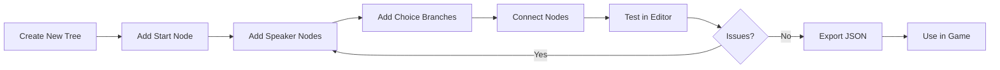

# Tool Spec: Dialogue Tree Editor

**Version:** 0.1
**Type:** Godot Editor Plugin (Main Screen)
**Priority:** CRITICAL
**Created:** 2026-01-12
**Build Estimate:** 40-60 hours
**ROI:** 3.5x (220 hours saved across 5 games)

---

## Problem Statement

**Pain Point:**
Writing 11,000+ lines of branching dialogue with skill checks, flags, and quest triggers in code or raw JSON is error-prone and impossibly slow.

**Current Workaround:**
- Write dialogue directly in JSON files
- Manually track branch connections
- Test by playing through game repeatedly
- Debug broken paths at runtime

**Impact:**
- Manual dialogue writing: ~60 hours per game
- With visual editor: ~20 hours per game
- **Savings: 40 hours/game × 5 games = 200+ hours**

---

## Target Users

| User | Use Case |
|------|----------|
| Writer | Create dialogue trees visually, focus on narrative |
| Designer | Add skill checks, reputation gates, quest triggers |
| Programmer | Debug dialogue flow, verify data export format |

---

## Core Functionality (MVP)

### Must Have

1. **Visual Node Canvas** - Drag-and-drop node editor with pan/zoom
2. **Core Node Types** - Speaker, Choice, Branch, End nodes
3. **Node Connections** - Visual arrows between nodes
4. **JSON Export** - Export tree to game-readable format
5. **Save/Load** - Persist dialogue trees as project files

### Phase 2 (Post-MVP)

6. **Advanced Node Types** - Skill check, Flag, Quest, Reputation, Item nodes
7. **In-Editor Testing** - Play through dialogue without running game
8. **Search & Filter** - Find nodes by speaker, keyword, ID
9. **Validation** - Detect orphan nodes, missing connections
10. **AI Integration** - Generate dialogue options via AI prompts

---

## Node Types

### MVP Nodes

| Node | Purpose | Inputs | Outputs |
|------|---------|--------|---------|
| **Start** | Entry point | None | 1 connection |
| **Speaker** | NPC dialogue line | speaker, text, portrait | Multiple (choices or next) |
| **Choice** | Player response option | text | 1 connection |
| **Branch** | Conditional split | condition | Multiple (per condition) |
| **End** | Conversation terminates | end_type | None |

### Phase 2 Nodes

| Node | Purpose | Properties |
|------|---------|------------|
| **Skill Check** | Roll against stat | skill, DC, success_next, fail_next |
| **Flag Check** | If story flag set | flag_name, true_next, false_next |
| **Flag Set** | Set story flag | flag_name, value |
| **Quest** | Start/complete quest | quest_id, action (start/complete/fail) |
| **Reputation** | Modify faction rep | faction, amount (+/-) |
| **Item** | Give/take items | item_id, quantity, action (give/take) |

---

## User Workflow



**Primary Flow:**
1. User creates new dialogue tree (File → New Dialogue)
2. Drag nodes from palette onto canvas
3. Connect nodes by dragging from output to input
4. Double-click nodes to edit properties
5. Press Play to test dialogue flow
6. Export to JSON when complete

---

## UI/UX Design

### Layout

```
┌─────────────────────────────────────────────────────────────────────┐
│  File  Edit  View  Test  Help                          [Validate]  │
├──────────────┬──────────────────────────────────────────────────────┤
│              │                                                      │
│  NODE        │              CANVAS                                  │
│  PALETTE     │                                                      │
│              │     ┌─────────┐                                      │
│  [Speaker]   │     │ START   │                                      │
│  [Choice]    │     └────┬────┘                                      │
│  [Branch]    │          │                                           │
│  [End]       │     ┌────▼────┐                                      │
│  ──────────  │     │ Thorne: │                                      │
│  [SkillChk]  │     │ "We     │──────┐                               │
│  [FlagChk]   │     │ need    │      │                               │
│  [FlagSet]   │     │ gold."  │      │                               │
│  [Quest]     │     └────┬────┘      │                               │
│  [Rep]       │          │           │                               │
│  [Item]      │     ┌────▼────┐ ┌────▼────┐                          │
│              │     │ Accept  │ │ Refuse  │                          │
│              │     └────┬────┘ └────┬────┘                          │
│              │          │           │                               │
├──────────────┴──────────┴───────────┴───────────────────────────────┤
│  dialogue_id: thorne_contract_1  │  Nodes: 12  │  Zoom: 100%       │
└─────────────────────────────────────────────────────────────────────┘
```

### Key UI Elements

| Element | Purpose |
|---------|---------|
| Node Palette | Drag nodes onto canvas |
| Canvas | Visual node graph with pan/zoom |
| Property Panel | Edit selected node (slides out on selection) |
| Toolbar | File ops, validation, export |
| Status Bar | Tree metadata, zoom level |
| Minimap | Overview for large trees (Phase 2) |

### Interactions

- **Drag from palette** → Creates new node at drop position
- **Click node** → Select, show properties panel
- **Double-click node** → Edit inline (text fields)
- **Drag from output port** → Create connection to another node
- **Right-click canvas** → Context menu (add node, paste)
- **Right-click node** → Delete, duplicate, disconnect
- **Mouse wheel** → Zoom in/out
- **Middle-click drag** → Pan canvas
- **Ctrl+S** → Save tree
- **Ctrl+E** → Export JSON
- **F5** → Test/play dialogue

### Node Visual Design

```
┌─────────────────────────┐
│ 🗣️ SPEAKER              │  ← Type icon + label
├─────────────────────────┤
│ Speaker: [Thorne     ▼] │  ← Dropdown (character list)
│ ┌─────────────────────┐ │
│ │ "We need gold to    │ │  ← Multi-line text area
│ │  fund the company.  │ │
│ │  Take this contract?"│ │
│ └─────────────────────┘ │
├─────────────────────────┤
│ Portrait: [thorne_neutral]│ ← Optional portrait override
├─────────────────────────┤
│ ○ → Choice 1            │  ← Output ports
│ ○ → Choice 2            │
│ ○ → Choice 3            │
└─────────────────────────┘
```

### Color Coding (by Speaker)

| Speaker | Color |
|---------|-------|
| Player | Blue (#3182ce) |
| Thorne | Orange (#d69e2e) |
| Lyra | Purple (#805ad5) |
| Matthias | Green (#38a169) |
| NPCs | Gray (#718096) |
| System | Red (#e53e3e) |

---

## Technical Notes

### Integration Points

**Godot API:**
- `EditorPlugin` - Register main screen
- `GraphEdit` - Base for node canvas
- `GraphNode` - Base for dialogue nodes
- `EditorFileSystem` - Detect file changes
- `ResourceSaver/Loader` - Save/load tree files

**File System:**
- **Input:** `.dtree` files (custom dialogue tree format)
- **Output:** `.json` files (game-readable dialogue data)
- **Location:** `res://data/dialogue/`

**Other Tools:**
- Character database (for speaker dropdown)
- Quest registry (for quest node autocomplete)
- Flag registry (for flag node autocomplete)

### Data Format

**Internal Format (.dtree):**
```json
{
  "dialogue_id": "thorne_contract_1",
  "metadata": {
	"author": "writer",
	"created": "2026-01-12",
	"modified": "2026-01-12",
	"version": 1
  },
  "canvas": {
	"zoom": 1.0,
	"offset": [0, 0]
  },
  "nodes": [
	{
	  "id": 1,
	  "type": "start",
	  "position": [100, 100],
	  "connections": [2]
	},
	{
	  "id": 2,
	  "type": "speaker",
	  "position": [100, 200],
	  "data": {
		"speaker": "Thorne",
		"text": "We need gold. Take this contract?",
		"portrait": "thorne_neutral"
	  },
	  "connections": [3, 4]
	},
	{
	  "id": 3,
	  "type": "choice",
	  "position": [50, 350],
	  "data": {
		"text": "Accept the contract.",
		"skill_check": null
	  },
	  "connections": [5]
	},
	{
	  "id": 4,
	  "type": "choice",
	  "position": [250, 350],
	  "data": {
		"text": "We don't need the money.",
		"skill_check": null
	  },
	  "connections": [6]
	}
  ]
}
```

**Export Format (.json) - Game Runtime:**
```json
{
  "dialogue_id": "thorne_contract_1",
  "nodes": {
	"1": {
	  "type": "speaker",
	  "speaker": "Thorne",
	  "text": "We need gold. Take this contract?",
	  "portrait": "thorne_neutral",
	  "next": ["2", "3"]
	},
	"2": {
	  "type": "choice",
	  "text": "Accept the contract.",
	  "effects": [],
	  "next": "4"
	},
	"3": {
	  "type": "choice",
	  "text": "We don't need the money.",
	  "effects": [
		{"type": "reputation", "faction": "Thorne", "amount": -5}
	  ],
	  "next": "5"
	},
	"4": {
	  "type": "quest",
	  "action": "start",
	  "quest_id": "contract_1",
	  "next": null
	}
  },
  "start": "1"
}
```

### Constraints

- **Performance:** Handle trees with 500+ nodes smoothly
- **Undo/Redo:** Full history for all operations
- **Auto-save:** Prevent data loss (every 60 seconds)
- **Large text:** Support dialogue lines up to 500 characters

---

## Testing Features (Phase 2)

### In-Editor Playback

```
┌─────────────────────────────────────────┐
│  TEST MODE                    [X Close] │
├─────────────────────────────────────────┤
│                                         │
│  ┌─────────────────────────────────┐   │
│  │      [Thorne Portrait]          │   │
│  │                                 │   │
│  │  "We need gold. Take this       │   │
│  │   contract?"                    │   │
│  └─────────────────────────────────┘   │
│                                         │
│  ┌─────────────────────────────────┐   │
│  │ > Accept the contract.          │   │
│  ├─────────────────────────────────┤   │
│  │ > We don't need the money.      │   │
│  └─────────────────────────────────┘   │
│                                         │
│  [◀ Back] [Restart] [Skip to Node ▼]   │
└─────────────────────────────────────────┘
```

**Test Features:**
- Play through dialogue choosing options
- See which flags/quests would be set
- Jump to any node directly
- Simulate skill check results
- Track path coverage (which nodes visited)

---

## AI Integration (Phase 2)

### Generate Dialogue Options

```
┌─────────────────────────────────────────────────┐
│  AI DIALOGUE GENERATOR                          │
├─────────────────────────────────────────────────┤
│                                                 │
│  Context: Thorne is asking the player to        │
│  accept a dangerous contract.                   │
│                                                 │
│  Generate: [3] response options                 │
│                                                 │
│  Tone: □ Honorable  □ Pragmatic  □ Greedy      │
│        □ Sarcastic  □ Suspicious  □ Eager      │
│                                                 │
│  Character Voice: [Player - Mercenary Captain] │
│                                                 │
│  [Generate]                                     │
│                                                 │
│  ─────────────────────────────────────────────  │
│                                                 │
│  Generated Options:                             │
│                                                 │
│  1. "Gold is gold. We'll take it."             │
│     [Insert] [Regenerate]                       │
│                                                 │
│  2. "What's the catch? Contracts that pay      │
│      this well usually have teeth."            │
│     [Insert] [Regenerate]                       │
│                                                 │
│  3. "The Iron Wolves don't shy from danger.    │
│      Tell us more."                            │
│     [Insert] [Regenerate]                       │
│                                                 │
└─────────────────────────────────────────────────┘
```

---

## Success Criteria

### MVP Complete When:
- [ ] Can create new dialogue tree
- [ ] Can add Speaker, Choice, Branch, End nodes
- [ ] Can connect nodes visually
- [ ] Can edit node properties (text, speaker)
- [ ] Can save/load .dtree files
- [ ] Can export to .json format
- [ ] Canvas supports pan and zoom
- [ ] Undo/redo works for all operations

### Phase 2 Complete When:
- [ ] All 10 node types implemented
- [ ] In-editor dialogue testing works
- [ ] Search/filter by speaker/keyword
- [ ] Validation catches orphan nodes
- [ ] Validation catches missing connections
- [ ] Color coding by speaker

### Tool is Successful When:
- Writer can create a 50-node dialogue tree in under 30 minutes
- Zero runtime errors from exported dialogue JSON
- All dialogue paths are testable without running the game

---

## Open Questions

- [ ] Should we support localization (multiple languages per tree)?
- [ ] Should node IDs be integers or UUIDs?
- [ ] Do we need audio preview for voice-acted lines (future)?
- [ ] Should conditions support complex expressions or just flag checks?
- [ ] Integration with character database - manual entry or auto-sync?

---

## References

- **Yarn Spinner** - Popular dialogue tool (inspiration for node types)
- **Twine** - Web-based story tool (inspiration for visual flow)
- **Godot GraphEdit** - Built-in node graph (technical foundation)
- **Ink** - Inkle's narrative scripting (inspiration for conditionals)

---

## Appendix: Full Node Type Specifications

### Speaker Node
```json
{
  "type": "speaker",
  "speaker": "string (character ID)",
  "text": "string (dialogue line, max 500 chars)",
  "portrait": "string (optional portrait override)",
  "voice_clip": "string (optional audio file path)",
  "animation": "string (optional character animation)"
}
```

### Choice Node
```json
{
  "type": "choice",
  "text": "string (player response text)",
  "skill_check": {
	"skill": "string (persuasion, intimidation, etc.)",
	"dc": "int (difficulty class)",
	"success_next": "int (node ID)",
	"fail_next": "int (node ID)"
  },
  "requirements": {
	"flags": ["array of required flags"],
	"items": ["array of required items"],
	"reputation": {"faction": "min_value"}
  },
  "tooltip": "string (shown on hover if requirements not met)"
}
```

### Branch Node
```json
{
  "type": "branch",
  "conditions": [
    {
	  "type": "flag|reputation|item|stat",
	  "key": "string",
	  "operator": "==|!=|>|<|>=|<=",
	  "value": "any",
	  "next": "int (node ID)"
    }
  ],
  "default": "int (node ID if no conditions match)"
}
```

### Quest Node
```json
{
  "type": "quest",
  "quest_id": "string",
  "action": "start|complete|fail|update",
  "objective": "string (optional, for update)"
}
```

### Reputation Node
```json
{
  "type": "reputation",
  "changes": [
	{"faction": "string", "amount": "int (+/-)"}
  ]
}
```

### Flag Node (Set)
```json
{
  "type": "flag_set",
  "flags": [
	{"name": "string", "value": "bool|int|string"}
  ]
}
```

### Flag Node (Check)
```json
{
  "type": "flag_check",
  "flag": "string",
  "operator": "==|!=|>|<",
  "value": "any",
  "true_next": "int",
  "false_next": "int"
}
```

### Item Node
```json
{
  "type": "item",
  "action": "give|take|check",
  "items": [
	{"item_id": "string", "quantity": "int"}
  ],
  "fail_next": "int (if check fails or can't take)"
}
```

### End Node
```json
{
  "type": "end",
  "end_type": "normal|combat|trade|exit_area",
  "trigger": "string (optional event to fire)"
}
```
